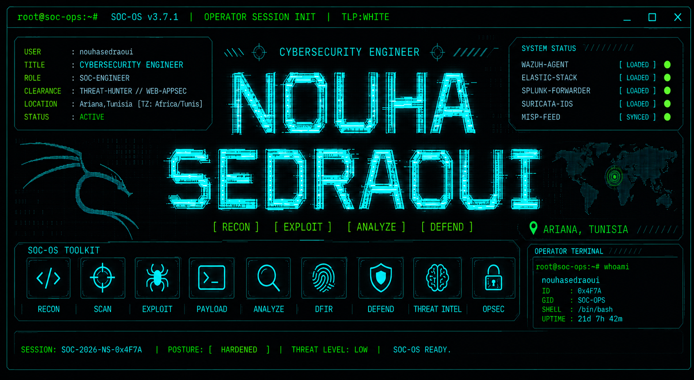

<div align="center">



<br/>

[](https://linkedin.com/in/sedraoui-nouha)
[](https://medium.com/@ryxocrypt)
[](https://github.com/nouhasedraoui)
[](mailto:Nouha.Sedraoui@esprit.tn)


</div>

---


## `[root@soc-ops ~]# yara -s ~/rules/operator_signature.yar /proc/memory_dump`

```
[YARA]  Scanning ....................................................... 🟢 MATCH FOUND
```

```yara
rule High_Value_Threat_Hunter {
    meta:
        operator     = "Nouha Sedraoui"
        role         = "Cybersecurity Engineer — SOC · AppSec · DevSecOps"
        location     = "Ariana, Tunisia"
        contact      = "Nouha.Sedraoui@esprit.tn"
        motto        = "Trust nothing. Monitor everything. Document everything."
    strings:
        $soc         = "Wazuh · ELK Stack · MISP · Active Response Automation"
        $appsec      = "Burp Suite · OWASP ZAP · SQLMap · Nuclei · Nikto"
        $ai_sec      = "DeepSeek · Grok · Llama · Qwen · Mistral via Ollama"
        $scripting   = "Python · PowerShell · Bash"
        $highlight_1 = "Splunk BOTSv1 — 16,193 pts · zero penalties · full Cerber v2 kill chain"
        $highlight_2 = "3 CVE analyses published · 1 Medium article · active threat intel researcher"
    condition:
        all of them
}
```

```
[YARA]  Classification  : Threat Hunter · SOC Builder · Security Researcher
[YARA]  Operator status : 🟢 ACTIVE — no vulnerabilities found in operator posture
```

---
## `[root@soc-ops ~]# dirb file:///home/operator/labs/ -ext .json,.yml`

```
[DIRB]  Scanning local artifact store .................................. 🟢 done
[DIRB]  4 high-value entries discovered
```

```diff
+ ==> /labs/CyberAudit_Pro/
    [+] ai_pipeline.json
        "AI-driven audit platform — 14 tools unified under Django,
         multi-model pipeline (DeepSeek · Grok · Llama · Mistral),
         ISO 27001-aligned, offline privacy-preserving mode."

+ ==> /labs/SOC_Infrastructure/
    [+] soc_deployment.json
        "Full SOC built with Wazuh + ELK Stack — APT correlation rules,
         Active Response automation, MISP threat intelligence integration."

+ ==> /labs/DevSecOps_Pipeline/
    [+] pipeline_policy.yml
        "Secured Spring Boot CI/CD — SonarQube · Trivy · OWASP Dep-Check
         enforced as policy gates in Jenkins & GitLab CI."

+ ==> /labs/Active_Directory_IAM/
    [+] ad_hardening.json
        "Deployed and hardened Windows AD — PingCastle posture scoring,
         Keycloak federated identity and SSO management."

+ ==> /labs/Forensics_Investigation/
    [+] case_report.json
        "Full Windows forensic investigation — Autopsy · FTK Imager · Volatility
         complete attack timeline reconstructed."
```

```
[DIRB]  Scan complete. 4/4 artifacts verified. No access denied.

```

## 🛡️ `[root@soc-ops ~]# ./thm_status.sh --operator rsd177`

```bash
[THM-API]  Querying TryHackMe operator profile: rsd177 ............. 🟢 200 OK
[THM-API]  Dashboard loaded — rendering operator telemetry...
```

<div align="center">

| Global Rank | Current Streak | Completed Rooms |
|:-----------:|:--------------:|:---------------:|
| 🌐 **Top 15%** | 🔥 **21 Days** | 🚪 **41 Rooms** |


### 🏅 EARNED SECURITY BADGES (8 OPERATIONAL)

| | | | |
|:-:|:-:|:-:|:-:|
|  |  |  |  |
| **Silver League** | **Bronze League** | **AI Odyssey** | **cat linux.txt** |
|  |  |  |  |
| **7 Day Streak** | **3 Day Streak** | **WWW** | **Webbed** |

</div>

...

## ⚙️ `[root@soc-ops ~]# cat /etc/soc-os/arsenal.conf`

```bash
[ARSENAL]  Enumerating operator toolkit ................................ 🟢 done
[ARSENAL]  Cross-referencing MITRE ATT&CK tool mappings ............... 🟢 complete
```

### Languages

|  |  |  |  |
|---|---|---|---|

### SOC / SIEM

|  |  |  |  |  |
|---|---|---|---|---|

### Penetration Testing

|  |  |  |  |  |
|---|---|---|---|---|

### DFIR / Network

|  |  |  |  |  |
|---|---|---|---|---|

### DevSecOps / Cloud

|  |  |  |  |  |
|---|---|---|---|---|

---

## 🗂️ `[root@soc-ops ~]# tree ~/cybersecurity-portfolio --depth 3`

```bash
[FS]  Rendering portfolio directory structure ......................... 🟢 done
```

```
cybersecurity-portfolio/
│
├── web-application-security/
│     ├── sql-injection/
│     │     └── portswigger-sqli-notes.md          ← Full PortSwigger SQLi lab series
│     └── server-side-vulnerabilities/
│           └── portswigger-server-side-vulns-notes.md ← Path traversal, SSRF, file upload, cmdi
│
├── threat-intelligence/
│     ├── CVEs/
│     │     ├── cve-analysis-template.md
│     │     ├── cpanel-cve-may-2026.md             ← Code exec + privesc in cPanel/WHM
│     │     └── cve-2026-7482-bleeding-llama.md    ← OOB Read, 300k+ servers exposed
│     ├── Webinaires & Podcasts/
│     │     └── sans-moab-webcast-2026.md
│     └── attack-techniques/supply-chain/
│           └── typosquatting.md
│
├── soc-labs/
│     ├── THM/                                      ← TryHackMe room notes
│     └── splunk-bots/
│           ├── botsv1-investigation-notes.md       ← Full Cerber v2 investigation
│           └── botsv1_ransomware_investigation.pdf ← Final incident report (score: 16,193)
│
├── tools-and-scripts/
│     ├── Python-Scripts/
│     │     └── Own_ones/
│     │           └── PyGhost-MAC.py               ← Custom MAC spoofing tool
│     └── Bash-Scripts/
│
├── Certifications/
│     ├── Fortigate/
│     │     ├── fortigate-administrator-notes.md
│     │     └── fcf-notes.md
│
└── resources/
      ├── network_protocols_reference.md
      └── useful-links.md
...

...


## 🏆 `[root@soc-ops ~]# cat /etc/soc-os/certifications.db`

```bash
[CERT-DB]  Querying operator credential store ......................... 🟢 done
[CERT-DB]  Verified issuers: Fortinet · Cisco · NVIDIA · Hedera
[CERT-DB]  Displaying active clearances...
```

| Certification | Issuer | Year |
|--------------|--------|------|
| Fortinet FCA — NSE 1 & NSE 2 Network Security Associate | Fortinet | 2026 |
| Cybersecurity Defense Analyst Career Path (Splunk & Cisco) | Cisco Netacad | 2026 |
| NVIDIA: Exploring Adversarial Machine Learning | NVIDIA | 2025 |
| Certified Cybersecurity Educator Professional (CCEP) | — | 2025 |
| Hedera Hashgraph Certified Developer | Hedera | 2024 |
| Cisco CyberOps Associate (SecFund & SecOps) | Cisco Netacad | 2023 |
| Cisco CCNA Security / Implementing Network Security | Cisco Netacad | 2023 |

```bash
[CERT-DB]  In-progress pipeline  ETA 2027:
           ├── CEH  (Certified Ethical Hacker) ..................... 🔵 IN PROGRESS
           ├── ISO/IEC 27001 Lead Auditor ......................... 🔵 IN PROGRESS
           └── Fortinet NSE 4 .................................... 🔵 IN PROGRESS
```

---

## 🧩 `[root@soc-ops ~]# ./thm_roomlog.sh --operator rsd177 --verbose`

```bash
[THM]   Operator rsd177: #1 Bronze League → #1 Silver League ......... 🟢 CONFIRMED
[THM]   Consecutive weekly leaderboard dominance confirmed.
[THM]   Loading room completion manifest...
```

**Ranked #1 in Bronze League · Promoted to Silver League · Ranked #1 in Silver League**
Consistent top performer across back-to-back weekly leaderboard cycles.

<details>
<summary><b>⚠️ [EXPAND] Web Application Security — Rooms Completed</b></summary>

| Room | Difficulty | Focus |
|------|-----------|-------|
| [How Websites Work](https://tryhackme.com/room/howwebsiteswork) | Easy | Web architecture fundamentals |
| [HTTP in Detail](https://tryhackme.com/room/httpindetail) | Easy | HTTP protocol, methods, status codes |
| [Putting it all Together](https://tryhackme.com/room/puttingitalltogether) | Easy | End-to-end web request lifecycle |
| [Web Application Basics](https://tryhackme.com/room/webapplicationbasics) | Easy | Core web app concepts |
| [Guided Pentest: Web](https://tryhackme.com/room/guidedpentestweb) | Easy | Web app pentesting — recon to full compromise |
| [CyberHeroes](https://tryhackme.com/room/cyberheroes) | Easy | CTF — authentication bypass |
| [W1seGuy](https://tryhackme.com/room/w1seguy) | Easy | CTF — plaintext cryptography |

</details>

<details>
<summary><b>⚠️ [EXPAND] SOC, DFIR & Forensics — Rooms Completed</b></summary>

| Room | Difficulty | Focus |
|------|-----------|-------|
| [DFIR: An Introduction](https://tryhackme.com/room/introductoryroomdfirmodule) | Easy | Digital forensics and incident response foundations |
| [Windows Forensics 1](https://tryhackme.com/room/windowsforensics1) | Medium | Windows Registry forensics |
| [KAPE](https://tryhackme.com/room/kape) | Medium | Kroll Artifact Parser & Extractor for DFIR collection |
| [Disk Analysis & Autopsy](https://tryhackme.com/room/autopsy2ze0) | Medium | Disk image forensics using Autopsy |
| [Memory Analysis Introduction](https://tryhackme.com/room/memoryanalysisintroduction) | Easy | Live memory forensics and threat detection |
| [Malware Classification](https://tryhackme.com/room/malwareclassification) | Easy | Identify and classify common malware types |
| [Dev Diaries](https://tryhackme.com/room/devdiaries) | Easy | OSINT — hunting development traces |

</details>

<details>
<summary><b>⚠️ [EXPAND] Defensive Security & SOC Concepts — Rooms Completed</b></summary>

| Room | Difficulty | Focus |
|------|-----------|-------|
| [Defensive Security Intro](https://tryhackme.com/room/defensivesecurityintroqW) | Easy | Threat intel, SOC, DFIR, SIEM |
| [Offensive Security Intro](https://tryhackme.com/room/offensivesecurityintrokK) | Easy | Ethical hacking fundamentals |
| [The CIA Triad](https://tryhackme.com/room/theciatriad) | Easy | Core security principles |
| [Cryptography Concepts](https://tryhackme.com/room/cryptographyconcepts) | Easy | Cryptography in digital environments |
| [Vectara](https://tryhackme.com/room/vectara) | Easy | CTF — 2026 AI Odyssey event |
| [AI Security Path Ticketing Event](https://tryhackme.com/room/aisecuritypathticketingevent) | Info | AI security fundamentals |

</details>

<details>
<summary><b>⚠️ [EXPAND] Systems & Networking Fundamentals — Rooms Completed</b></summary>

| Room | Difficulty | Focus |
|------|-----------|-------|
| [Linux Fundamentals 1](https://tryhackme.com/room/linuxfundamentalspart1) | Info | Linux CLI essentials |
| [Bash Scripting](https://tryhackme.com/room/bashscripting) | Easy | Bash automation |
| [Windows Fundamentals 1–3](https://tryhackme.com/room/windowsfundamentals1xbx) | Info | Windows desktop, registry, security, BitLocker |
| [What is Networking?](https://tryhackme.com/room/whatisnetworking) | Info | Computer networking fundamentals |
| [DNS in Detail](https://tryhackme.com/room/dnsindetail) | Easy | DNS protocol and resolution |
| [Nmap](https://tryhackme.com/room/furthernmap) | Easy | Advanced Nmap scanning techniques |
| [Nmap Basic Port Scans](https://tryhackme.com/room/nmap02) | Easy | TCP connect, SYN, and UDP scan internals |
| [Cloud Computing Fundamentals](https://tryhackme.com/room/cloudcomputingfundamentals) | Easy | Cloud scaling and service models |
| [DevSecOps Basics](https://tryhackme.com/room/devsecopsbasics) | Medium | Shift-left security, development models |

</details>

<details>
<summary><b>⚠️ [EXPAND] Scripting & Development — Rooms Completed</b></summary>

| Room | Difficulty | Focus |
|------|-----------|-------|
| [Python Basics](https://tryhackme.com/room/pythonbasics) | Easy | Python scripting fundamentals |
| [Bash Scripting](https://tryhackme.com/room/bashscripting) | Easy | Bash automation |

</details>

---

## 📡 `[root@soc-ops ~]# git log --oneline --graph --all`

<div align="center">


</div>

---

## 📈 `[root@soc-ops ~]# ./sys_diagnostics.sh --module github-telemetry`

```bash
[TELEMETRY]  Querying GitHub API ..................................... 🟢 rate limit OK
[TELEMETRY]  Rendering operator commit statistics and language distribution.
```

<div align="center">
  <table border="0" cellspacing="0" cellpadding="0">
    <tr>
      <td align="center" valign="top">
        
      </td>
      <td align="center" valign="top">
        
      </td>
    </tr>
  </table>
</div>

---

## `[root@soc-ops ~]# shutdown -h now`

```diff
- [SYS]  Closing threat intelligence feeds ........................... done
- [SYS]  Archiving session logs ..................................... done
+ [SYS]  Operator offline · posture: HARDENED · trace: none
```

<div align="center">

> ### *"To know your enemy, you must become your enemy."*
> #### — Sun Tzu

</div>


